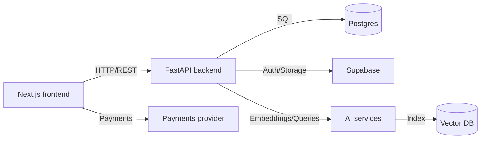

# BiharRozgar.in — Interview cheat-sheet

This one-page cheat-sheet helps you present the project, your role, and answers to common technical and behavioral interview questions.

---

## Elevator pitches

- **One-line (resume):** Built BiharRozgar.in — a regional job marketplace using Next.js (TS) frontend and FastAPI backend with AI-powered search and chat, Supabase integration, and Dockerized deployment.
- **30-second (spoken):** I built BiharRozgar.in, a focused job platform for Bihar that combines a modern Next.js + Tailwind UI with a FastAPI backend. I owned backend endpoints, data models, OTP auth, AI-enhanced search/chat (embeddings + retriever), and integrations with Supabase and payments. The app is Dockerized for consistent dev and deployment.

---

## Quick project summary (what to say first)

- **Problem:** Local job-seekers in Bihar need a simple, relevant place to find jobs and apply.
- **Solution:** A web platform with job search/filter, candidate profiles, applications, OTP login, and AI-assisted search/chat for better discovery.
- **Stack:** Next.js + TypeScript + Tailwind, FastAPI (Python), Postgres, Supabase, Docker Compose, vector embeddings for AI.

---

## My role (how to phrase it)

- **Title:** Full-Stack Developer / Primary Contributor
- **Responsibilities (short):** Designed and implemented backend APIs and DB models, built frontend job search and auth flows, integrated AI embeddings/RAG, connected Supabase/payment hooks, and Dockerized the stack for deployment.

---

## Top accomplishments to call out

- Implemented job CRUD and application flows with validation and schemas.
- Built OTP-based authentication and secure session handling.
- Added AI features: embeddings, retrievers, and an AI chat assistant to improve search relevance.
- Integrated Supabase utilities for auth/storage and connected payment hooks.
- Wrote SQL migration/init scripts and Docker Compose for local/dev environments.

---

## Architecture (short, use diagram if asked)



Say: frontend calls backend APIs; backend handles business logic, persists to Postgres, uses Supabase for auth/storage, and calls AI embedding+vectorstore for semantic search / chat.

---

## Demo script (what to show, short)

1. Start services: run `docker compose up --build` (recommended).
2. Open the site (typically `http://localhost:3000`), show job listing and filters, open a `JobCard` and the apply flow.
3. Show creating a profile / login via OTP and describe the flow.
4. Use the AI chat/search to demonstrate improved results.
5. Show backend quickly (API list or a single endpoint) and the SQL migration file to prove DB design.

Commands (quick):

```bash
# start all services (recommended)
docker compose up --build

# frontend only
cd frontend
npm install
npm run dev

# backend (if running locally)
cd backend
# use poetry or pip according to your setup
uvicorn app.main:app --reload --port 8000

# run backend tests
pytest -q
```

---

## Common technical questions — short answers you can memorize

- **Tell me about the project:** (use the 30-second pitch above.)
- **What was your role?:** I was the primary full-stack dev: backend endpoints, data models, OTP auth, AI search/chat, integration and deployment.
- **How does OTP auth work?:** User submits phone/email → backend generates short code saved with TTL → sends code via SMS/email provider → user submits code → backend verifies and issues JWT/session.
- **How does AI search/chat work?:** We embed job content into vectors, store them in a vectorstore, embed user queries, retrieve nearest neighbors, optionally use retrieval-augmented generation (RAG) to provide context to an LLM.
- **Why FastAPI and Next.js?:** FastAPI for fast, type-friendly Python APIs and async support; Next.js for SSR/SSG and a fast developer experience with TypeScript.
- **How would you scale search?:** Use a managed vector DB (Pinecone/Redis/Weaviate), shard/index by category, batch embedding jobs, add caching and horizontal API scaling behind a load balancer.
- **How did you ensure data integrity?:** Pydantic schemas, DB constraints, transactional operations for application flows, and API validation.

---

## Tough question prep (examples + answers)

- **Q:** Tell me about a hard bug or tradeoff.
  - **A:** Improving search relevance was hard: we added embeddings + prompt engineering and re-ranking. We measured improvements with user feedback and adjusted retriever parameters.

- **Q:** How do you secure user data?
  - **A:** OTP-based auth avoids passwords, we sign tokens, use HTTPS, store minimal PII, and rely on DB-level access controls and environment secrets for providers.

---

## Files and code to open during interview

- Show the frontend search and `JobCard` component for UI.
- Open backend API route for jobs and the `auth_otp` flow to explain implementation and validation.
- Show `sql/001_fastapi_identity_cutover.sql` or DB init file to discuss schema.
- Open AI-related code (embeddings/retriever/vectorstore) to explain the pipeline.

You can open these quickly in the editor to point at concrete code.

---

## Resume / recruiter-ready lines you can copy

- **One-liner (recruiter):** Full-Stack Developer on BiharRozgar.in — built an end-to-end regional job platform using Next.js + Tailwind and FastAPI; implemented job CRUD, OTP auth, AI-powered search/chat, Supabase integrations, and Dockerized deployment.
- **CV bullet (first-person):** Developed BiharRozgar.in, a job marketplace for Bihar: designed backend APIs and DB models, implemented OTP authentication, integrated AI semantic search and chat, connected Supabase and payments, and containerized the app for consistent deployments.

---

## Demo/dry-run tips

- Have a demo account ready (or seed DB) so you don't need to sign up live.
- Keep the terminal logs visible when discussing backend work (shows activity for endpoints/OTP/AI requests).
- If asked about metrics, be honest — prepare active user / job counts if you have them; otherwise say you can follow up.

---

## Next steps (for me or you)

- If you want, I can role-play an interviewer (behavioral + technical). Say "mock interview" and pick a mode (short/standard/deep dive).
- I can also create a trimmed one-page PDF or a printable cheat-sheet if you prefer.

---

Good luck — say the parts you want to rehearse and I will mock them with you.
